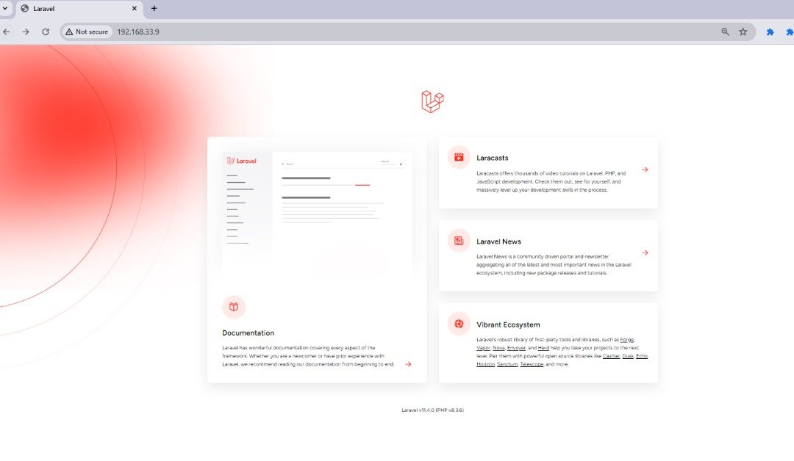

# Task

Automate the provisioning of two Ubuntu-based servers, named “Master” and “Slave”, using Vagrant.
On the Master node, create a bash script to automate the deployment of a LAMP (Linux, Apache, MySQL, PHP) stack.
This script should clone a PHP application from GitHub, install all necessary packages, and configure Apache web server and MySQL.
Ensure the bash script is reusable and readable.
Using an Ansible playbook: Execute the bash script on the Slave node and verify that the PHP application is accessible through the VM’s IP address (take screenshot of this as evidence) Create a cron job to check the server’s uptime every 12 am. 

## Provision two Ubuntu-based servers

# Connected the slave node to the master

# Create bashscript on master node

# Create ansible playbook to execute bashscript on slave

# Access my app via IP Address

